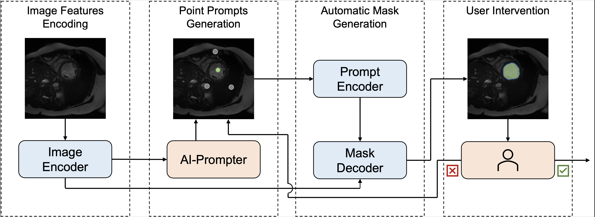
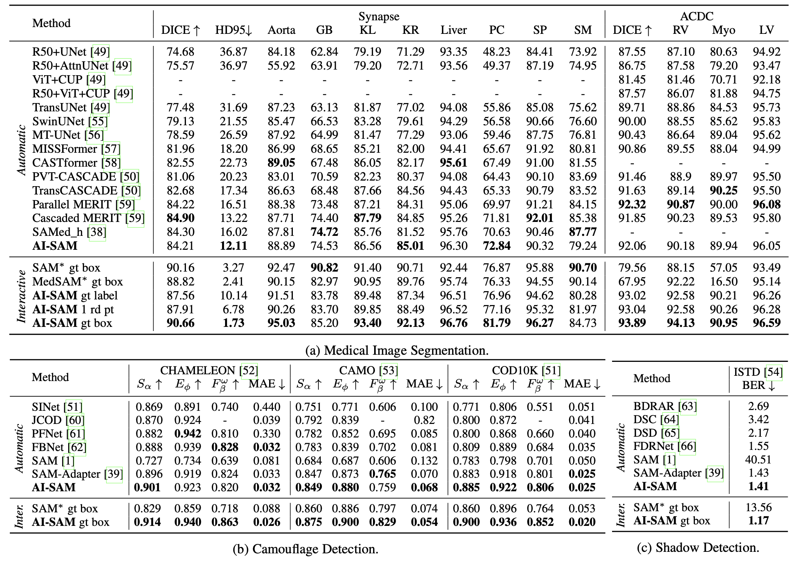

# AI-SAM

AI-SAM: Automatic and Interactive Segment Anything Model


Yimu Pan, Sitao Zhang, Alison D. Gernand, Jeffery A. Goldstein, James Z. Wang

[[`Paper`](https://arxiv.org/abs/2312.03119)] [[`BibTeX`](#citations)] [[`Demo`](automatic_interactive_demo.ipynb)]

The Automatic and Interactive Segment Anything Model (AI-SAM) is designed to streamline the process of generating segmentation masks for various classes automatically while support interactive user input. During its training phase, AI-SAM acquires the capability to produce both the point prompts and segmentation masks for each class, using only the segmentation masks themselves as learning targets.

In the inference stage, AI-SAM automatically generates a set of point prompts, along with the segmentation masks for each class. This feature facilitates a user-friendly interaction; users can directly modify the point prompts to adjust the segmentation masks as needed.
Below is an overview of the entire AI-SAM pipeline:
 

## Performance
The detail analysis is in the paper. We present the main result table below:
 

## Installation
The code requires `python>=3.8`, `pytorch>=1.7`, and `torchvision>=0.8`.

You will also need the following packages.
```
scipy
scikit-learn
scikit-image
opencv-python
matplotlib
ipywidgets
notebook
```

## Automatic Evaluation

### ACDC
Prepare the dataset following [MT-UNet](https://github.com/Dootmaan/MT-UNet). Then, download the pretrained [weight](https://pennstateoffice365-my.sharepoint.com/:u:/g/personal/ymp5078_psu_edu/EVHZbBpy07RIr_0ABr3AedgBlgR5wTbgQ8SmDz_9f3n4nA?e=RPn9Mv). Finally, you may run the following code to obtain the scores in the paper:
```sh
python eval_one_gpu.py --dataset acdc --use_amp -checkpoint [path-to-the-downloaded-weight] -model_type vit_h --tr_path [path-to-the-dataset-dir] --use_classification_head --use_lora --use_hard_point
```

### Synapse
Prepare the dataset following [TransUNet](https://github.com/Beckschen/TransUNet/tree/main). Then, download the pretrained [weight](https://pennstateoffice365-my.sharepoint.com/:u:/g/personal/ymp5078_psu_edu/EdAjEX2E5hNFg8e7t7YetZEBUCGQmfiLN3V1eSiDzvao2A?e=Mw80aw). Finally, you may run the following code to obtain the scores in the paper:
```sh
python eval_one_gpu.py --dataset synapse --use_amp -checkpoint [path-to-the-downloaded-weight] -model_type vit_h --tr_path [path-to-the-dataset-dir] --use_classification_head --use_lora --use_hard_point
```

## Automatic and Interactive Demo
Refer to [this notebook](automatic_interactive_demo.ipynb) for detail. AI-SAM will first generate a set of foreground and background points base on the class of choice and the user can modify the points base on the segmentation result.

## Using AI-SAM with SAM-Adapter
Please refer to [SAM-Adapter](./SAM-Adapter/README.md) dir.

## License

This work is licensed under [Apache 2.0 license](LICENSE).

## Citations
If you find this work useful, please cite:
```
@article{pan2023ai,
  title={AI-SAM: Automatic and Interactive Segment Anything Model},
  author={Pan, Yimu and Zhang, Sitao and Gernand, Alison D and Goldstein, Jeffery A and Wang, James Z},
  journal={arXiv preprint arXiv:2312.03119},
  year={2023}
}
```


## Acknowledgements
The code is modified from [MedSAM](https://github.com/bowang-lab/MedSAM/tree/main), [SAM-Adapter](https://github.com/tianrun-chen/SAM-Adapter-PyTorch) and [SAM](https://github.com/facebookresearch/segment-anything). We also used the LoRA implementation from [SAMed](https://github.com/hitachinsk/SAMed/tree/main).
